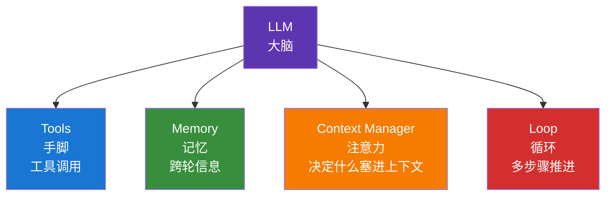

# 1.2 Agent 与 Harness Engineering

## 一句话理解

**Agent** = 能自己**调用工具**、**循环执行**、**做决策**的 AI 系统。
**Harness** = 把 LLM 装成 Agent 的那一整套外壳（脚手架）。

如果 LLM 是发动机，Agent 是装上手脚和方向盘的车，**Harness Engineering 就是设计这台车的工艺**。

## 从 ChatGPT 到 Agent

最直观的对比：

| 维度 | 普通 Chat 模式 | Agent 模式 |
|---|---|---|
| 能力 | 只能输出文本 | 能调用工具（搜索、读文件、跑代码） |
| 流程 | 一问一答，单轮 | 多轮循环，自主决定下一步 |
| 决策 | 你来决定下一步问什么 | AI 自己决定下一步做什么 |
| 失败处理 | 你重新问 | AI 自己重试或换策略 |
| 例子 | ChatGPT 网页版聊天 | Claude Code、Cursor Agent、Hermes |

经济学研究中的具体差别：

!!! example "找一份《经济研究》最新一期的目录"

    **Chat 模式**：

    > 你：帮我找《经济研究》2026 年第 5 期目录
    > AI：抱歉我无法访问互联网，请你查询后告诉我。

    **Agent 模式**：

    > 你：帮我找《经济研究》2026 年第 5 期目录
    > AI：[调用浏览器] → 搜索"经济研究 2026 第5期"
    > → [打开知网期刊页] → 抓取目录
    > → [格式化] → 返回 12 篇论文标题+作者+页码

    **同样的问题，差别在于 AI 能不能动手。**

## Agent 的核心组件

一个能干活的 Agent 至少要四样东西：



| 组件 | 作用 | 经济学场景例子 |
|---|---|---|
| **Tools** | 让 AI 能"动手" | 查 CEIC、读 PDF、跑 Stata、爬 POI |
| **Memory** | 跨对话记住关键信息 | 记住你的研究方向、常用变量、论文框架 |
| **Context Manager** | 决定每轮塞什么进 LLM 上下文 | 文献库 1000 篇，只塞最相关的 20 篇 |
| **Loop** | 多步骤迭代直到完成 | "找数据→清洗→跑回归→出表→改格式"全自动 |

## 什么是 Harness

如果你只把 LLM API 当聊天框用，调一次回一次，那不是 Agent。

**Harness（外壳）就是把上面四个组件粘起来的代码框架**，包括：

- 工具调用循环（一轮工具调用失败了怎么办？要不要重试？）
- Token 预算管理（200K 上下文怎么分配？）
- 错误恢复（工具报错怎么传回 LLM？）
- 流式输出（让你能看到 AI 边想边说）
- 中断与恢复（你按 Ctrl+C 后状态保存哪儿）
- 多轮对话压缩（超出窗口怎么压缩历史）
- 安全机制（什么操作要二次确认）

**这些设计决定了 Agent 好不好用，远比"用什么 LLM"重要。**

## 主流 Harness 对比

经济学研究者会接触到的几款：

| Harness | 形态 | 强在哪 | 弱在哪 | 适合谁 |
|---|---|---|---|---|
| **ChatGPT / Claude.ai** | 网页 | 零门槛、内置工具、最稳 | 工作流封闭、无法自定义 | 全员 |
| **Cursor / Trae / Windsurf** | IDE | 写代码体验好、IDE 内嵌 | 偏代码场景，做研究略重 | 写代码的研究者 |
| **Claude Code / Codex** | 终端 CLI | 最强工程能力、深度可控 | 命令行门槛、需要订阅/中转 | 折腾派 |
| **Hermes** | 终端 + 飞书/Discord | 多平台、本地+云端、Skill 体系 | 配置复杂 | 想搭自己工作流的 |
| **Manus / 扣子空间** | 网页 Agent | 国内可访问、能开浏览器 | 工具受限、不能本地化 | 国内用户先试用 |
| **Aider** | 终端 CLI | 轻量、Git 友好 | 功能少 | 极简主义 |

**没有最好的 Harness，只有最适合你工作流的 Harness。**

## Harness Engineering：为什么它比 Prompt Engineering 重要

很多人停留在"提示词工程"——研究怎么把指令写得更好。这在 Chat 模式时代很有用，但 Agent 时代权重已经偏移：

```
传统：好的输出 ≈ 好的提示词

现在：好的输出 ≈ 好的提示词 × 好的 Context × 好的工具 × 好的循环
                           ↑ 这些是 Harness 决定的
```

举一个真实例子。同一句话："帮我精读这篇论文"：

| 用什么 | 实际效果 |
|---|---|
| 网页版 ChatGPT | 你要先把 PDF 复制粘贴进对话框（图表丢失） |
| Cursor + PDF 插件 | 能直接打开 PDF，但识别图表仍弱 |
| Claude Code + econ-paper-notes Skill | 自动按"研究问题 / 数据 / 识别 / 结论 / 局限"五栏提取，给原文页码 |

**提示词没变，输出质量差出几个数量级。差别全在 Harness。**

## 给经济学研究者的核心要点

1. **Agent 是会用工具的 LLM**，能上网、读文件、跑代码、做决策
2. **Harness 是把 LLM 装成 Agent 的脚手架**，决定 Agent 好不好用
3. **同一个 LLM，不同 Harness，能力差异巨大**
4. **选 Harness 比调提示词重要**：先选对工具，再调提示词

下一节讲：在选对 Harness 之后，怎么用 **Context Engineering** 把 LLM 的能力榨干。

---

[:octicons-arrow-left-24: 1.1 大模型基础](llm-basics.md) · [下一节：1.3 Prompt 与 Context Engineering :octicons-arrow-right-24:](prompt-context.md)
