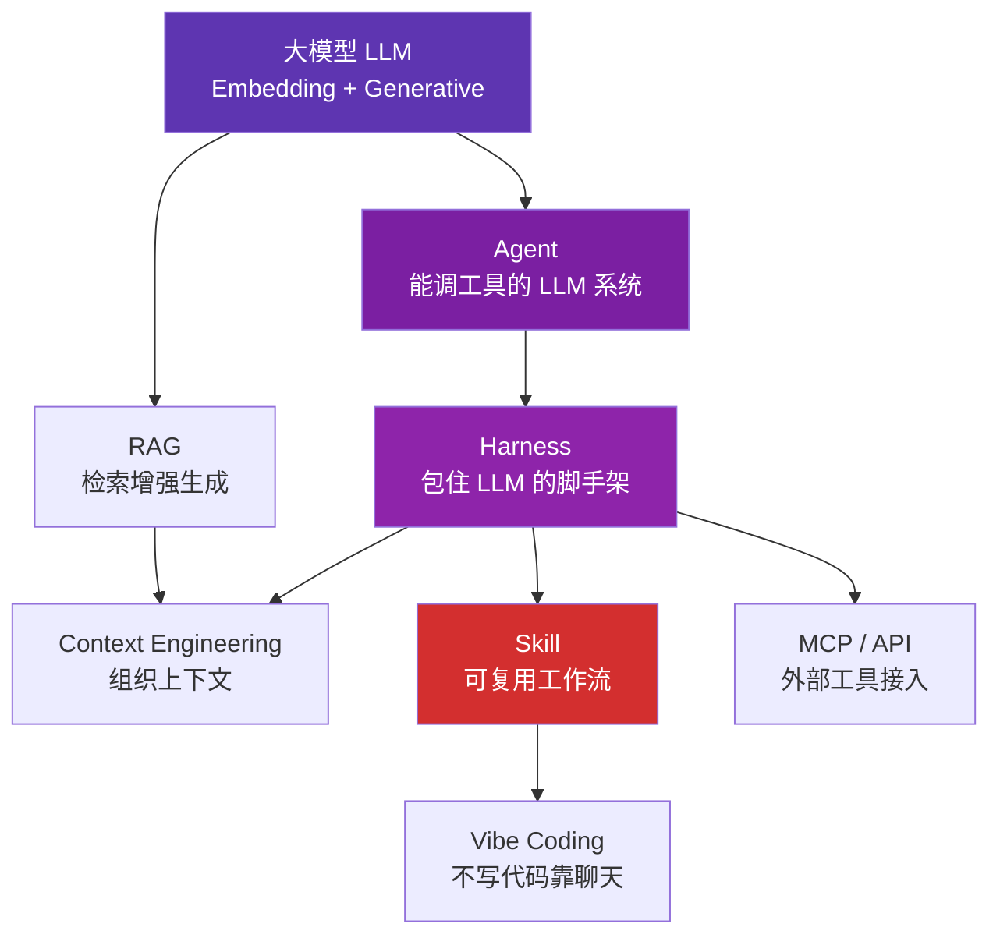

# 概念地图

经济学研究者用 AI 时，最常见的不是技术问题，而是**名词混乱**——Agent、Skill、MCP、RAG 几个词混着用，不知道差别在哪，也就没法判断什么场景该用什么工具。

这一章把核心概念拆开讲清楚。**不追求技术细节**，追求的是：读完以后你能用同行听得懂的话解释这些名词，并且知道什么场景用什么。

## 阅读路径

如果你时间紧张，按下面的路径选读：

- :material-school:{ .lg .middle } **完全新手**

    ---

    1.1 大模型基础 → 1.5 Skill 的本质 → 1.7 Vibe Coding 边界

    （三节读完已经能跟人聊 AI 协作）

- :material-account-tie:{ .lg .middle } **听说过 ChatGPT，想理解原理**

    ---

    按顺序读 1.1 → 1.7

- :material-laptop:{ .lg .middle } **想搭自己工作流的研究者**

    ---

    1.2 Agent → 1.3 Context → 1.5 Skill → 1.6 MCP

    （这四节是搭工作流的"四根柱子"）

## 七个概念之间的关系

简单说：

- **LLM** 是发动机，单独用只能聊天
- **Agent** 给发动机装上手脚（工具调用），能干活了
- **Harness** 是把发动机+手脚+大脑装成一台车的整套机械结构
- **Context Engineering** 是怎么给这台车装"该看的资料"
- **Skill** 是"按这个标准化流程办事"的说明书
- **RAG** 是从你的文献库现挖现学
- **MCP / API** 是外接的各种"专用工具"
- **Vibe Coding** 是"我只下指令，你来开车"

## 章节列表

- [1.1 大模型基础](llm-basics.md)：Embedding vs 生成模型、上下文窗口、Token、幻觉
- [1.2 Agent 与 Harness Engineering](agent-harness.md)：Agent 是什么，Harness 比 Prompt 更重要
- [1.3 Prompt 与 Context Engineering](prompt-context.md)：从一句话到一整套环境
- [1.4 RAG 与知识库](rag.md)：检索增强生成的本质，知识库不是越大越好
- [1.5 Skill 的本质](skill.md)：为什么它比 Prompt 模板更值得投资
- [1.6 MCP 与 API](mcp-api.md)：MCP 协议是怎么回事，与传统 API 的关系
- [1.7 Vibe Coding 的边界](vibe-coding.md)：什么时候能 vibe，什么时候必须自己写

---

[:octicons-arrow-right-24: 开始：1.1 大模型基础](llm-basics.md)
