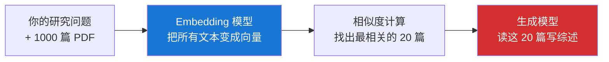

# 1.1 大模型基础

## 一句话理解

**大语言模型（LLM）** 是一个被训练成"看到一段话，预测下一个词最可能是什么"的概率机器。它的所有能力——回答问题、写代码、做综述——本质都是这个"预测下一词"任务的延伸。

## Embedding 模型 vs 生成模型

经济学研究者最常混淆的两类模型：

| 维度 | Embedding 模型 | 生成模型 |
|---|---|---|
| 输入 | 文本 | 文本（+图像/音频） |
| 输出 | **向量**（一串数字） | **文本** |
| 典型代表 | text-embedding-3、BGE、Jina | GPT-4o、Claude、DeepSeek、Kimi |
| 干什么用 | 检索、相似度、聚类 | 对话、写作、推理 |
| 会不会"幻觉" | 不会（不生成文字） | 会 |

**它们是配合关系，不是替代关系。**

文献综述的真实流程：



- Embedding 模型负责**找相关的**
- 生成模型负责**读懂并写出来**

为什么不直接把 1000 篇全塞给生成模型？因为：上下文窗口装不下，token 成本爆炸，长上下文里"中间部分"模型记不住（**Lost in the Middle 现象**）。

## 上下文窗口（Context Window）

模型一次能"看到"的最大文本量。这是理解 AI 行为的关键概念。

主流模型 2025 年的容量：

| 模型 | 上下文窗口 | 约等于 |
|---|---|---|
| Claude Sonnet 4 | 200K tokens | 30 万汉字 / 500 页 |
| GPT-4o | 128K tokens | 19 万汉字 / 320 页 |
| Gemini 2.5 Pro | 1M tokens | 150 万汉字 / 2500 页 |
| DeepSeek-V3 | 128K tokens | 19 万汉字 |
| Kimi | 200K tokens（部分模型 1M） | 30-150 万汉字 |
| Qwen-Max | 128K tokens | 19 万汉字 |

!!! warning "为什么 AI 会'忘事'"
    模型对话超过上下文窗口时，最早的内容会被**截断**或**压缩**。这就是你聊一会儿发现 AI"忘了"前面说过什么的原因。

    应对：长任务用 Skill / Memory 机制把关键信息固定住，不要全靠对话历史。

## Token

模型处理文本的最小单位，**不是字也不是词**。

经验估算：

- 1 token ≈ 0.75 个英文单词 ≈ 1.5 个汉字
- 200K tokens ≈ 30 万汉字 ≈ 一本书

为什么要关心 token？

1. **API 计费按 token 算**：用 Claude API 跑文献综述，一篇论文 PDF 约 5-10K tokens，跑 100 篇就是百万级 tokens，要花钱
2. **上下文限制**：超出窗口就得截断
3. **输出长度限制**：单次生成通常不超过 8K-32K tokens

## 幻觉（Hallucination）

**AI 编造内容，且说得很自信**。

这是经济学研究里 **杀伤力最强** 的问题。常见三种翻车：

### 1. 编造文献

```
你问：找一篇关于教育财政与地方税收的实证文献

AI 答：
- Smith et al. (2018) "Local Tax and School Quality" Journal of
  Public Economics, 162: 45-67. 该文用美国 1990-2015 年面板数据...
```

**作者+年份+期刊+期号+页码全都看起来很像真的，但论文不存在**。AI 是"按经济学论文该长什么样"去生成的。

### 2. 错引页码 / 错引数据

```
你问：Card & Krueger (1994) 最低工资研究的样本量是多少？

AI 答：约 1500 家快餐店，覆盖 NJ 和 PA 两州。

实际：约 410 家。
```

数字它记不住，但会"猜一个像样的"。

### 3. 张冠李戴

把 A 论文的结论安到 B 论文头上。两篇都是真论文，但结论被换了。

### 防御策略

| 翻车类型 | 防御方法 |
|---|---|
| 编造文献 | 所有引用上 Google Scholar 核查，看 DOI 能不能解析 |
| 错引数据 | 让 AI 给出**原文页码**，自己抽查 |
| 张冠李戴 | 关键引用回原文找原话 |

!!! tip "底线规则"
    **凡是要写进论文的引用、数据、结论，AI 给的都是 draft，必须人工核实原始来源。**

    这不是不信任 AI，而是学术规范。论文署了你的名，责任就在你。

## 模型选择速查

经济学研究场景，2026 年初的推荐：

| 任务 | 首选 | 备选 |
|---|---|---|
| 长文本精读（论文综述） | Claude Sonnet 4 | Kimi、Gemini 2.5 Pro |
| 中文写作 / 改稿 | DeepSeek-V3 | Qwen-Max、智谱 GLM |
| 数据分析 / 写代码 | Claude Sonnet 4 | DeepSeek-V3 |
| 推理 / 数学 | OpenAI o3、DeepSeek-R1 | Claude Sonnet 4 |
| 检索 / 文献查找 | 配合 Elicit / Consensus | DeepSeek + 联网 |
| 无网/隐私场景 | 本地 Ollama + Qwen / DeepSeek | LM Studio |

!!! note "关于版本"
    模型迭代极快，本表 6 个月就会过时。最新对比看 [LMSys Chatbot Arena](https://lmarena.ai/) 排行榜，但**注意排行榜不区分中英文能力**，中文场景以国产模型实测为准。

## 给经济学研究者的核心要点

1. **Embedding 和生成模型分工不同**，文献综述要两个一起用
2. **上下文窗口是硬约束**，超了就忘事，长任务要用 Skill / Memory 兜住
3. **幻觉无法根除，只能防御**，所有学术引用必须人工核实
4. **模型选型按场景不按口碑**，长文本认 Claude，中文写作认国产，推理认 o3 / R1

下一节讲：怎么把 LLM 这个"发动机"装成能干活的 **Agent**，以及为什么 Harness 比 Prompt 重要。

---

[:octicons-arrow-left-24: 概念地图](index.md) · [下一节：1.2 Agent 与 Harness Engineering :octicons-arrow-right-24:](agent-harness.md)
