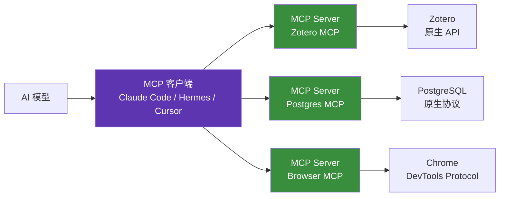

# 1.6 MCP 与 API

## 一句话理解

- **API（Application Programming Interface）**：传统的程序对程序通信接口，每家服务一种格式
- **MCP（Model Context Protocol）**：Anthropic 在 2024 年提出的协议，让 AI 模型能**统一接入各种外部工具和数据源**

打个比方：**API 像各种型号的插座（USB-A、USB-C、Lightning、HDMI），MCP 像一个万能转接头**。

## 为什么需要 MCP

经济学研究里 AI 要接的东西太多：

- 文献库（Zotero、Web of Science）
- 数据源（CEIC、Wind、Statistica、CNKI）
- 写作工具（Obsidian、Notion）
- 浏览器（自主上网检索）
- 文件系统（读写本地 PDF / Excel）
- 数据库（PostgreSQL / SQLite）

**传统做法**：每个工具都要专门写 Plugin / Function Calling 代码，AI 厂商每对接一个工具就要工程开发。结果是工具碎片化、移植性差。

**MCP 的思路**：定义一套**统一协议**，工具开发者按这套协议出"MCP Server"，AI 客户端只要支持 MCP 就能用所有 MCP Server。

## MCP 与 API 的关系

**MCP 不是要替代 API，而是包一层标准**：



每个 MCP Server **内部**还是用原生 API 跟实际服务通信。MCP 只是**把"AI 怎么调用工具"这件事标准化了**。

类比理解：

| 层 | 角色 |
|---|---|
| AI 模型 | 你 |
| MCP 客户端 | 翻译官 |
| MCP Server | 各种"特定语种翻译官"（中翻日、中翻英...） |
| 实际服务（Zotero / Wind） | 外国客户 |

你只需要会跟一个翻译官说话（MCP），翻译官替你处理所有底层差异。

## 经济学研究中的 MCP 实例

### 已经存在的 MCP Server

| MCP Server | 干什么 | 经济学场景 |
|---|---|---|
| **Filesystem MCP** | 读写本地文件 | 处理 PDF / Excel / CSV |
| **Browser MCP / Playwright MCP** | 让 AI 控制浏览器 | 自主上网检索文献、政策文件 |
| **Postgres / SQLite MCP** | 数据库查询 | 用 SQL 查百万级面板数据 |
| **Zotero MCP** | 接 Zotero 文献库 | AI 直接搜你的文献库 |
| **Obsidian MCP** | 接 Obsidian Vault | 读写笔记 |
| **Git MCP** | Git 仓库操作 | 论文版本管理 |
| **GitHub MCP** | GitHub 操作 | 找复现代码、看 Issue |

### 一个完整的研究场景

任务：**精读一篇论文，并把它的复现代码跑出来**。

不用 MCP 时：

1. 你下载 PDF
2. 把 PDF 拖到 Claude.ai
3. AI 给笔记
4. 你打开期刊网页找作者代码
5. 你下载代码
6. 你打开 Stata 跑代码
7. 你把报错复制给 AI
8. AI 给修复方案
9. 你改代码再跑

**全程你是中间人，AI 没动手能力。**

用 MCP 时：

1. 你跟 AI 说："精读这篇论文 + 跑通它的复现代码"
2. AI 通过 **Filesystem MCP** 读取你下载的 PDF
3. AI 通过 **Browser MCP** 自己去期刊页面找复现代码
4. AI 通过 **Filesystem MCP** 把代码下载到本地
5. AI 通过 **Terminal MCP** 跑 Stata
6. 报错 → AI 自动修复 → 再跑
7. AI 输出："论文笔记已生成，复现代码运行成功，主要结果与原文一致"

**AI 真的"动手"了。**

## 怎么用 MCP

### 哪些 Harness 支持 MCP

截至 2026 年初：

| 工具 | MCP 支持 |
|---|---|
| **Claude Code** | ✅ 原生 |
| **Claude.ai 桌面版** | ✅ 原生 |
| **Hermes** | ✅ 原生 |
| **Cursor** | ✅ 已支持 |
| **OpenAI ChatGPT** | ✅ 2025 年开始支持 |
| **国产 IDE / 网页版** | ⚠️ 部分支持，进展中 |

### 安装与配置

以 Claude Code 为例（其他 Harness 类似）：

```json
// ~/.config/claude-code/mcp.json
{
  "mcpServers": {
    "filesystem": {
      "command": "npx",
      "args": ["-y", "@modelcontextprotocol/server-filesystem", "/Users/liusongyue/Documents"]
    },
    "zotero": {
      "command": "uvx",
      "args": ["mcp-server-zotero"]
    },
    "browser": {
      "command": "npx",
      "args": ["-y", "@playwright/mcp"]
    }
  }
}
```

启动 Claude Code，AI 自动拥有这三个工具。

### 找 MCP Server

- [MCP 官方目录](https://github.com/modelcontextprotocol/servers)
- [Smithery.ai](https://smithery.ai/)：MCP Server 集散地
- [ClawHub](https://clawhub.dev/)：很多 Skill 包附带 MCP

## MCP 的限制与风险

不是银弹。三个要注意的点：

### 1. 安全风险

MCP Server 跑在你本地，能读你文件、上网、跑命令。**装第三方 MCP Server 等于装一个新软件**：

- 只装可信源的（官方、Smithery 验证过的）
- 别装陌生 GitHub 上下载的
- 涉及私密数据的 MCP Server 看清权限范围

### 2. 性能开销

每个 MCP Server 是独立进程。装 20 个会显著增加内存占用和启动时间。**按需启用，不要全装**。

### 3. 标准还在演化

MCP 协议 2024 年底才发布，2026 年还在快速迭代。部分 MCP Server 可能因为协议升级而不可用。**关注官方 changelog**。

## 经济学研究者的起步建议

不要一上来配 20 个 MCP。从最高频的开始：

### 第一批（必装 3 个）

1. **Filesystem MCP**：读写本地 PDF / Excel / 数据
2. **Browser MCP / Playwright MCP**：让 AI 自主检索
3. **Git MCP**：版本管理

### 第二批（按需）

- **Zotero MCP**（如果你深度用 Zotero）
- **Obsidian MCP**（如果你用 Obsidian 做笔记）
- **数据库 MCP**（如果你处理大数据）

### 不必要

- 各种小众工具的 MCP（直接用原生工具更快）

## 给经济学研究者的核心要点

1. **MCP 是标准化协议**，让 AI 统一接入各种工具
2. **MCP 不替代 API**，而是在 AI 调用层做了标准化
3. **核心价值是让 AI 真的"动手"**，不只是聊天
4. **安全风险真实存在**，第三方 MCP Server 谨慎装
5. **从 3 个核心 MCP 起步**：文件系统 / 浏览器 / Git

最后一节：**Vibe Coding 的边界**——什么时候可以放手让 AI 写代码，什么时候必须自己写。

---

[:octicons-arrow-left-24: 1.5 Skill 的本质](skill.md) · [下一节：1.7 Vibe Coding 的边界 :octicons-arrow-right-24:](vibe-coding.md)
