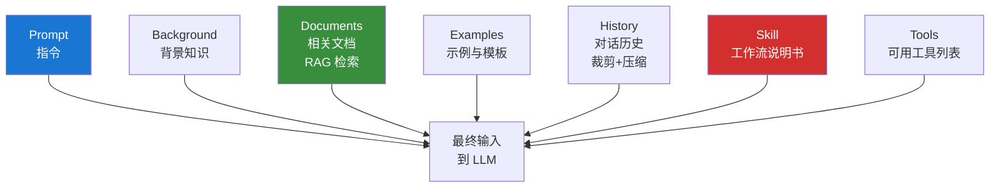

# 1.3 Prompt 与 Context Engineering

## 一句话理解

- **Prompt Engineering**：研究怎么把**一句指令**写得更好
- **Context Engineering**：研究怎么把**整个上下文**（指令 + 背景 + 工具 + 历史 + 示例）组织得更好

前者是战术，后者是战略。**研究场景里，Context Engineering 远比 Prompt Engineering 重要。**

## 为什么 Prompt Engineering 还不够

2023 年大家都在写"完美提示词"，"你是一位资深经济学家，请用学术语言..."。这种思路在简单任务上还行，但研究场景一上手就崩。

考虑这个真实任务：**写一篇关于"数字鸿沟与教育不平等"的文献综述**。

光靠提示词工程能写到什么程度：

> 你是一位资深教育经济学家，请用学术规范的中文，
> 以"数字鸿沟与教育不平等"为题撰写一篇 5000 字文献综述，
> 包含理论框架、实证发现、研究缺口三部分...

输出的问题：

1. **AI 不知道你领域的核心文献**，列的全是它训练数据里的旧研究，可能 2022 年后的全没有
2. **AI 不知道你的写作风格**，输出"标准 AI 综述腔"
3. **AI 不知道你的研究框架**，给的"研究缺口"很套话
4. **AI 编造文献**，五六篇不存在的引用

提示词再优化，这些问题都解决不了——因为问题不在提示词，而在**上下文的供给**。

## Context Engineering 的核心思路

把"喂给 LLM 的所有东西"当成一个完整的**信息环境**来设计：



**输出质量 ≈ Σ (输入信号的质量 × 信号被组织的方式)**

提示词只是其中一根输入线。

## 一个研究场景的对比

同样的任务"写综述"，做 Context Engineering 之前 vs 之后：

=== "之前（只调提示词）"

    ```
    指令：你是一位资深教育经济学家，
    请撰写一篇关于"数字鸿沟与教育不平等"的文献综述
    ```

    AI 输入只有这句话。

=== "之后（Context Engineering）"

    ```
    [指令]
    撰写"数字鸿沟与教育不平等"文献综述

    [背景]
    - 我的研究方向：教育财政、数字经济
    - 计划投：JEEM / Education Economics / 中国工业经济
    - 字数：6000 中文

    [文献库]（自动检索的 30 篇核心论文摘要+我的笔记）
    - Goldin & Katz (2018) ...
    - Card et al. (2022) ...
    - 罗楚亮等 (2023) ...
    （每篇带：研究问题、数据、识别、结论、与本综述关系）

    [写作风格示例]
    （我之前发表的一段综述节选，3000 字）

    [研究框架]
    （我的"数字鸿沟三层结构"分析框架，500 字）

    [技能调用]
    使用 literature-synthesis Skill 中的"矩阵式综述法"

    [可用工具]
    - Zotero MCP（检索我的本地文献库）
    - Google Scholar 搜索
    - 引用核查工具
    ```

    AI 输入是上面**完整的一套**。

效果差别：第一种你拿到的是"AI 综述"，第二种你拿到的是**"用你的文献、按你的框架、贴你的风格写的初稿"**。

## Context Engineering 的五大杠杆

实战中最有用的五个手段：

### 1. RAG 检索注入

不要让 AI 凭"它训练时记住的文献"瞎写。**把你的真实文献库 / 笔记 / 数据接进来**，让它现学现用。

经济学场景：Zotero MCP、本地 PDF 库、Obsidian Vault、CNKI / Web of Science 检索 API。

### 2. 示例（Few-shot）

给 AI 看 3-5 个**理想输出的样子**，比写 1000 字的指令还有效。

例：让 AI 给文献做笔记，与其用文字描述格式，不如直接贴一份你以前写的笔记，让它"按这个格式做"。

### 3. Skill 注入

把工作流（步骤、避坑、验证）写成 SKILL.md，每次任务自动加载。这是 Skill 的核心价值——见 [1.5 Skill 的本质](skill.md)。

### 4. 工具与决策权

告诉 AI 它**能做什么**（可用工具）以及**该不该做**（什么场景下用哪个工具）。

例：综述任务里给两个工具——"Zotero 库内检索"和"Google Scholar 联网检索"，规则是"先查本地，找不到再联网"。

### 5. 历史管理

长任务里，对话历史会膨胀到超出上下文窗口。**主动决定保留什么、压缩什么、丢弃什么**。

例：跑 30 篇文献的精读，每篇出笔记后**只保留笔记，原文 PDF 解析结果丢弃**，节省 token。

## 经济学研究者的 Context 配方

我自己用得最多的一套配方（你可以直接抄）：

```yaml
每次研究任务的标准 Context：

1. 角色定位：经济学博士候选人，研究方向 X
2. 项目背景：当前论文标题、研究问题、目标期刊
3. 知识库：
   - Zotero 主库（接 MCP）
   - Obsidian Vault（文献笔记 + 学者画像）
   - 我的已发表论文（写作风格参考）
4. Skill：根据任务自动加载
   - 综述任务 → literature-synthesis
   - 精读任务 → econ-paper-notes
   - 实证任务 → stata-regression
5. 工具集：
   - Zotero MCP、浏览器、文件读写、Stata/R/Python 执行
6. 输出规范：
   - 中文学术语言
   - 引用必须可核查
   - 关键结论标原文页码
```

这套 Context 一旦搭好，**每次新任务只需要写一句指令**。差别是天壤的。

## 给经济学研究者的核心要点

1. **Prompt Engineering 是战术，Context Engineering 是战略**
2. **同一句指令在不同 Context 下，输出质量差几个量级**
3. **五大杠杆**：RAG / Few-shot / Skill / 工具 / 历史管理
4. **搭一套自己的 Context 配方比反复调提示词高效得多**

下一节讲 Context Engineering 中最重要的一个杠杆：**RAG 与知识库**。

---

[:octicons-arrow-left-24: 1.2 Agent 与 Harness Engineering](agent-harness.md) · [下一节：1.4 RAG 与知识库 :octicons-arrow-right-24:](rag.md)
