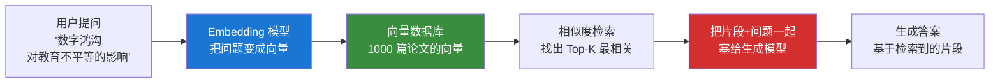

# 1.4 RAG 与知识库

## 一句话理解

**RAG（Retrieval-Augmented Generation，检索增强生成）**：在 AI 生成内容**之前**，先从你的知识库中**检索**相关片段，把片段塞进上下文，再让 AI 基于这些片段写答案。

简单说：**不让 AI 凭记忆写，让它"现查现写"**。

## 为什么需要 RAG

LLM 单独使用，三个硬伤：

| 硬伤 | 表现 | RAG 怎么解决 |
|---|---|---|
| 训练数据有截止日期 | 2024 年的政策、2025 年的论文不知道 | 实时检索最新内容塞进上下文 |
| 没有你的私人文献库 | 你 Zotero 里 500 篇论文 AI 没见过 | 把私人库接成检索源 |
| 把 1000 篇全塞上下文太贵 | Token 爆炸、Lost in the Middle | 每次只检索最相关的 10 篇 |

**RAG 把"记忆问题"转化成了"检索问题"**——这是关键的范式转变。

## RAG 的工作流程

**核心步骤**：

1. **建库（Indexing）**：把所有文档切片，每片用 Embedding 模型变成向量，存进向量数据库
2. **检索（Retrieval）**：用户提问 → 问题变向量 → 找最相似的 Top-K 片段
3. **生成（Generation）**：检索到的片段 + 问题 → 生成模型 → 答案

## 知识库不是越大越好

最常见的误区。

研究者直觉：把 Zotero 全库 5000 篇论文都加进来，AI 能力最强。

实际情况：

| 库大小 | 实际效果 |
|---|---|
| 50 篇精挑核心文献 | ⭐⭐⭐⭐⭐ 综述精准、引用扎实 |
| 500 篇中等筛选 | ⭐⭐⭐⭐ 大部分场景够用 |
| 5000 篇全量 | ⭐⭐ 检索到很多无关的；噪声压过信号 |
| 50000 篇随便堆 | ⭐ 检索质量崩溃 |

**为什么？**

- 检索是基于**语义相似度**的，不是基于"领域权威性"的
- 一篇水平很差但措辞相似的论文，会和顶刊论文一起被检出
- 噪声片段挤掉了真正相关的核心文献

## 知识库建设的三档建议

### 第一档：核心文献库（Core）

- **范围**：你研究问题最直接相关的 30-100 篇
- **筛选标准**：自己读过、做过笔记、能用一句话说出贡献
- **用途**：综述、精读、对比

### 第二档：领域库（Domain）

- **范围**：你领域内的高引论文 + 顶刊近 5 年文章，500-2000 篇
- **筛选标准**：发在你目标期刊上的、被你 Core 库引用过的
- **用途**：扩展检索、找相关研究

### 第三档：背景库（Background）

- **范围**：跨领域参考资料、政策文件、报告，不限数量
- **筛选标准**：来源可信即可
- **用途**：背景信息、补充论据

**实战中**：让 RAG 系统**优先检索 Core，找不到再扩展到 Domain，Background 仅在明确需要时调用**。

## 经济学研究者的 RAG 工具栈

### 现成工具（开箱即用）

| 工具 | 适合场景 | 备注 |
|---|---|---|
| **NotebookLM** | 快速做单主题笔记 | Google 出品，免费、支持中文 |
| **Elicit** | 文献检索 + 简单 RAG | 学术专用，自动 RAG |
| **Consensus** | 基于论文的问答 | 适合查具体研究结论 |
| **SciSpace** | PDF 精读 RAG | 单篇深度解析 |
| **ChatPDF** | 单 PDF RAG | 最简版 |

### 自建方案（深度定制）

适合愿意折腾的研究者：

- **Zotero + AI 插件**（如 Aria、ZotFile + AI）：基于本地文献库
- **Obsidian + Smart Connections / Copilot**：基于笔记库
- **LlamaIndex / LangChain**：自己写代码搭，最灵活
- **Hermes Skill**：用 retrieval-strategy + literature-synthesis 这类 Skill 组合

### 国内可访问

- **Kimi**：上传 PDF 直接对话，本质就是 RAG
- **DeepSeek + 联网搜索**：实时 RAG
- **元宝、扣子空间**：上传文档对话

## 学术 RAG 的特殊要求

经济学场景对 RAG 的要求**比通用场景严格**：

### 1. 必须可溯源

每个结论必须能追溯到**原文页码**。RAG 系统应该返回：

> **答案**：Card & Krueger (1994) 发现最低工资上调对就业无显著负向影响。
>
> **来源**：Card, D., & Krueger, A. B. (1994). American Economic Review, 84(4), 772-793. **第 783 页第 2 段**。

不能只是"根据 Card & Krueger (1994)..."。

### 2. 必须有质量过滤

垃圾文献进知识库，输出也是垃圾。建议：

- 顶刊优先：AER / QJE / JEEM / 经济研究 / 管理世界
- 引用门槛：CNKI 引用 50+ 或 Google Scholar 100+
- 自己读过：至少看过摘要 + 引言

### 3. 必须区分中英文

中文文献和英文文献的 Embedding 空间分开建索引，避免**跨语言相似度计算偏差**。

## 给经济学研究者的核心要点

1. **RAG = 检索 + 生成**，让 AI 现查现写而不是凭记忆
2. **知识库质量 > 数量**，50 篇精选远胜 5000 篇杂乱
3. **三档结构**：Core / Domain / Background，分级使用
4. **学术场景必须**：可溯源、质量过滤、中英文分离
5. **新手起步**：用 NotebookLM / Kimi 上传 PDF 直接体验

下一节：把 RAG / Context Engineering / Tools 这些"零散组件"打包成可复用工作流的关键概念——**Skill**。

---

[:octicons-arrow-left-24: 1.3 Prompt 与 Context Engineering](prompt-context.md) · [下一节：1.5 Skill 的本质 :octicons-arrow-right-24:](skill.md)
