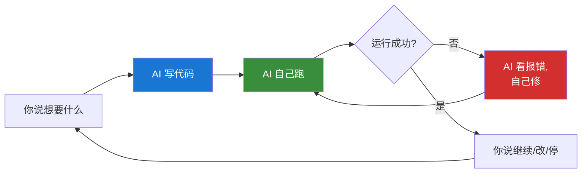
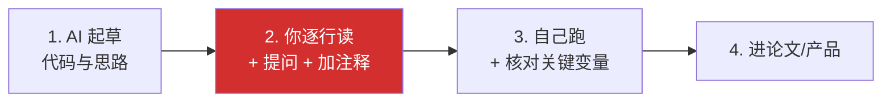
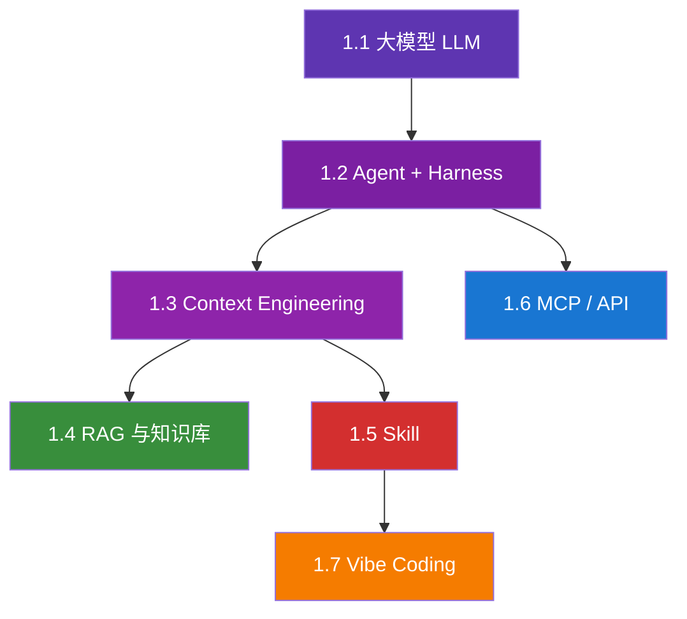

# 1.7 Vibe Coding 的边界

## 一句话理解

**Vibe Coding**：你不写代码，**靠和 AI 聊天**就把功能做出来。

这个词 2025 年由 OpenAI 的 Andrej Karpathy 推火。本质是：放弃"读懂每一行代码"的执念，**用自然语言驱动工程**。

但**研究场景里 vibe 是有边界的**。这一节讲清楚什么时候能 vibe，什么时候必须自己写。

## Vibe Coding 在干什么

不是新东西，本质是 **Context Engineering 的极端形态**——

- **Context**：你的需求描述 + AI 自带的代码能力 + 它能调用的工具（运行代码、读文件）
- **Output**：可运行的代码

工作流程：

你的角色从"编码者"变成"产品经理"。

## 经济学研究里 Vibe 能做什么

### 适合 Vibe 的场景

#### ① 一次性脚本

- 爬一次某网站数据
- 把 PDF 表格提取成 Excel
- 给 100 个文件批量改名
- 转换数据格式

**特点**：用完即弃，不维护。AI 写得乱也无所谓。

#### ② 探索性数据分析

- 看看数据长什么样、有多少缺失值
- 画个分布图、相关性矩阵
- 跑几个简单回归试试方向

**特点**：你只关心结果，代码本身不进论文。

#### ③ 你不熟的语言

你是 Stata 党，今天要用 Python 处理一份大数据，没时间学 Pandas——直接 vibe，让 AI 主导。

**特点**：学习成本远大于使用成本，临时任务时 vibe 划算。

#### ④ 原型验证

- "我想试试用 LLM 做文本分析能不能跑通"
- "想看看这个想法是否可行再投入"

**特点**：证明可行性，能跑就行。

### 不适合 Vibe 的场景

#### ① 进论文的实证分析

回归代码、识别策略实现、稳健性检验——**这些是论文的命脉**。

**为什么不能 vibe**：

- 期刊要求复现，你得能解释每一行
- 审稿人会问"你为什么这样做"，你得答得出来
- AI 偶尔会"创造性发挥"——比如自己加了个奇怪的样本筛选条件，你没注意，就翻车

**底线**：实证代码必须自己**逐行读懂**，注释清楚。AI 可以帮你写，但不能你不读。

#### ② 涉及金额、安全、隐私的逻辑

- 处理实名数据
- 接触公司财务数据
- 调用付费 API（怕 AI 写出死循环烧钱）

**为什么不能 vibe**：错一行就翻车，且不可逆。

#### ③ 长期维护的项目

你的研究项目数据流水线、工具库、个人 Python 包——这些是要用一两年的。

**为什么不能 vibe**：

- AI 写的代码风格可能不一致
- 半年后你回来读自己的"AI 写的"代码，没注释、没结构，等于重写
- 维护成本远大于初次开发成本

**底线**：长期项目必须自己设计架构，AI 写实现。

#### ④ 安全敏感场景

- 数据库写入操作
- 文件批量删除
- 涉及系统配置的脚本

**底线**：让 AI **先 dry-run 给你看**，确认无误再执行。

## Vibe 的真实风险

### 1. 你不知道自己不知道什么

AI 写的回归代码看起来跑通了，结果是 5%。你欢呼。

**实际上**：AI 偷偷把"个人收入"变成了"家庭收入"，你的论文站在错误前提上。

**防御**：关键变量描述统计自己看，关键步骤 print 出来核对。

### 2. 复现性灾难

你 vibe 写了 30 个脚本拼成的数据流水线，论文投出去了。

**审稿人**：请提供复现代码。
**你**：[打开代码] 这都是啥？AI 写的我也忘了原理。

**防御**：进论文的代码 vibe 完一定要自己**重读 + 加注释**。

### 3. 安全事故

你让 AI 帮你"清理一下数据文件"。AI 跑了 `rm -rf`。

**防御**：

- 重要文件先备份
- 让 AI 先 dry-run（"先告诉我会删哪些，不要执行"）
- 用 Git 版本控制

### 4. 学术伦理

期刊问："这部分代码是 AI 写的吗？"
你说："是。"

期刊：那请声明，并说明你是否核查过。

**防御**：投稿前确认期刊政策。多数期刊允许 AI 协助但要求声明。

## 经济学研究者的"半 vibe"工作流

完全 vibe 风险大，完全自己写慢。**折中方案**：

**关键是第 2 步——AI 写完，你必须自己过一遍**。

具体做法：

- 让 AI 在每段代码上加详细注释（用中文，符合你的语言习惯）
- 每段关键步骤让 AI 解释"为什么这样做"
- 中间结果让 AI print 出来给你看
- 关键参数（样本筛选、变量定义、缩尾分位数）你自己拍板

## 不同任务的 Vibe 度

按"可以多放心 vibe"的程度排序：

| 任务 | Vibe 度 | 备注 |
|---|---|---|
| 一次性爬虫 | 🟢 90% | 跑完即弃 |
| 数据格式转换 | 🟢 90% | 输入输出明确 |
| 描述统计、画图 | 🟡 70% | 自己看图核对 |
| 数据清洗 | 🟡 60% | 关键变量自己核 |
| 简单回归 | 🟡 50% | 系数方向自己核 |
| 论文主回归 | 🔴 30% | 必须自己读懂每行 |
| DID / IV / RDD 实现 | 🔴 20% | 识别策略自己理解 |
| 财务/隐私敏感 | 🔴 10% | 必须自己写或仔细审 |

绿色：放心 vibe；黄色：vibe 后核对；红色：必须自己写或精读。

## 给经济学研究者的核心要点

1. **Vibe Coding 是 Context Engineering 的极端形态**，让 AI 主导编码
2. **适合 vibe**：一次性脚本、探索性分析、不熟的语言、原型验证
3. **不适合 vibe**：进论文的代码、长期维护、安全敏感、敏感数据
4. **半 vibe 工作流**：AI 起草 → 你重读+注释 → 自己跑+核对 → 进论文
5. **底线**：进论文的每一行代码你都要能解释

---

## 概念地图小结

到这里你已经读完了概念地图全章。回顾七个概念的关系：

**这套概念是后续所有章节的基础**。读到 Pipeline 章节看到"调用 econ-paper-notes Skill"，你知道这意味着什么；读到"接 Zotero MCP"，你知道为什么这样做。

下一章 [工具栈](../tools/index.md) 会把这些概念落到具体工具上。

---

[:octicons-arrow-left-24: 1.6 MCP 与 API](mcp-api.md) · [下一章：工具栈 :octicons-arrow-right-24:](../tools/index.md)
